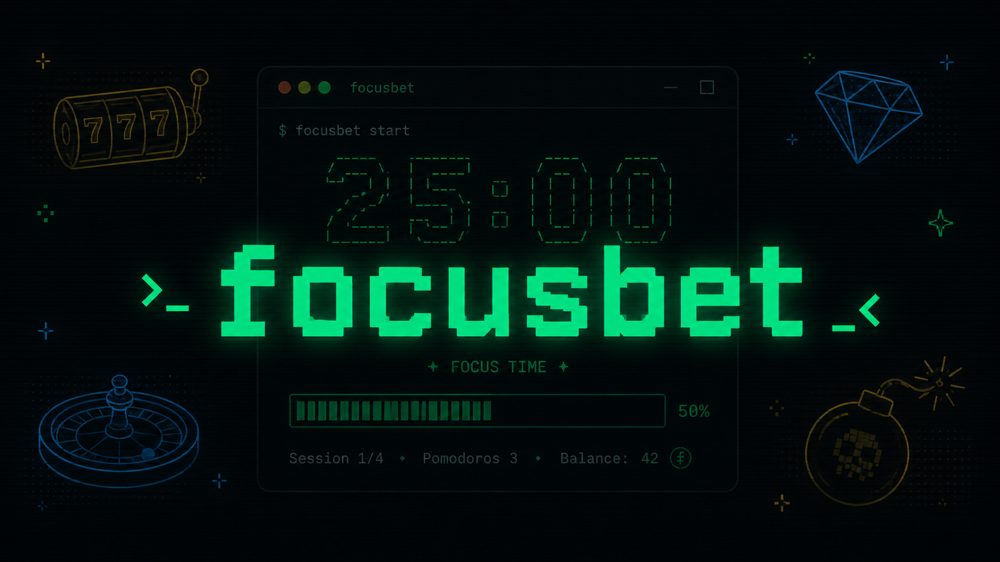
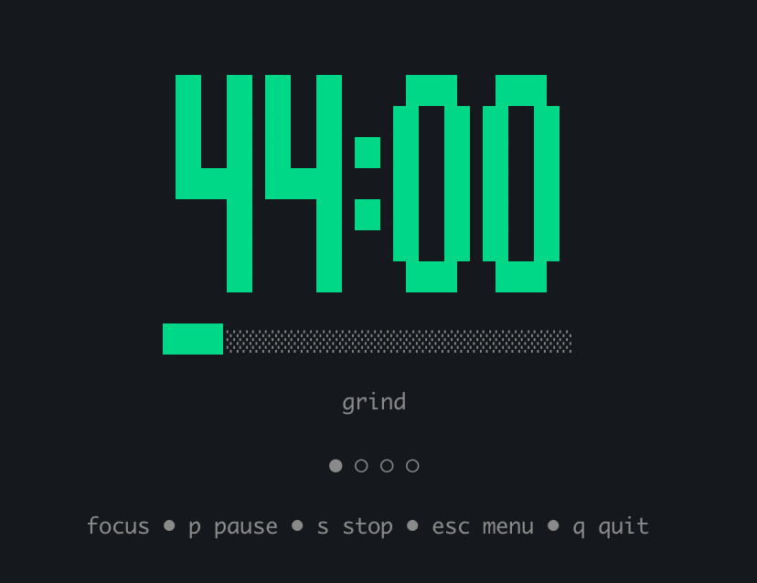
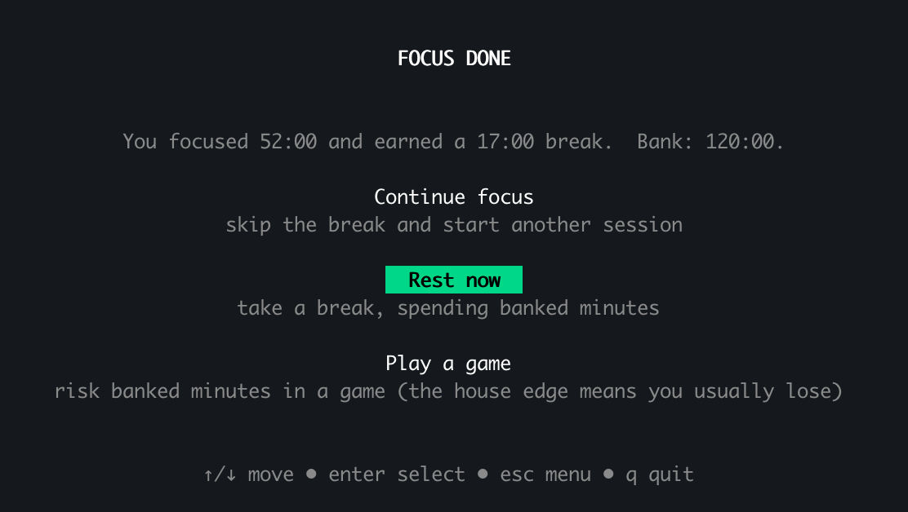
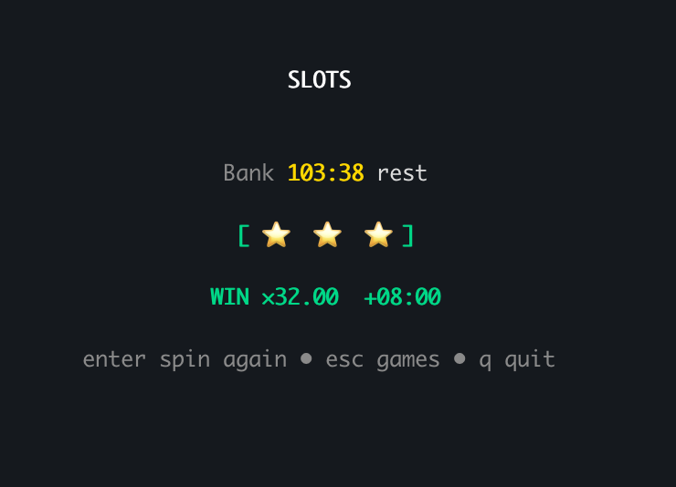
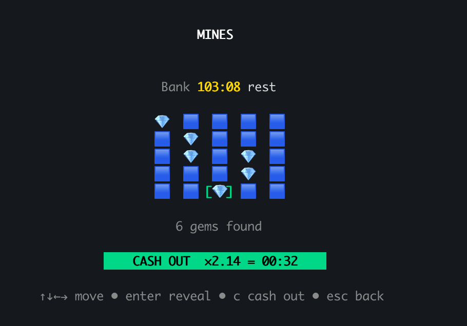
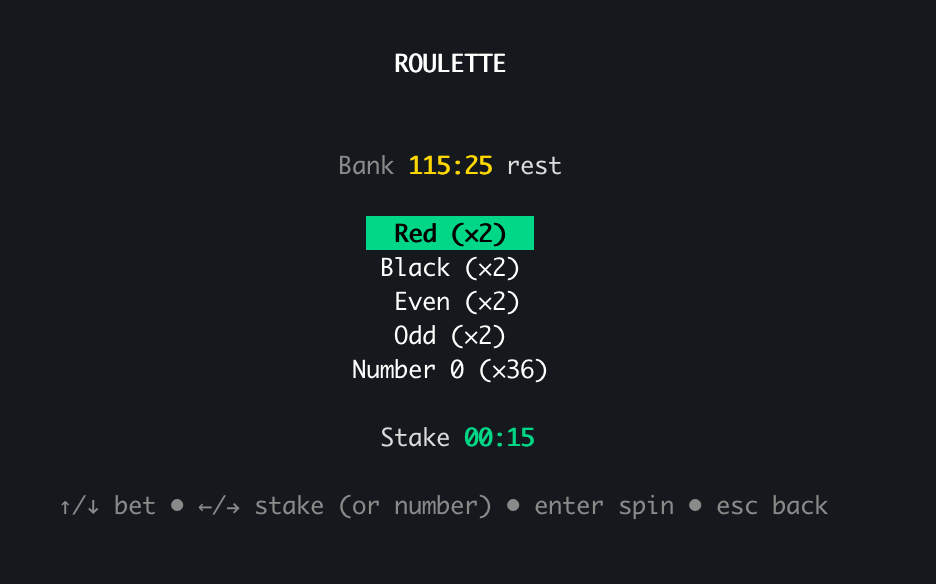
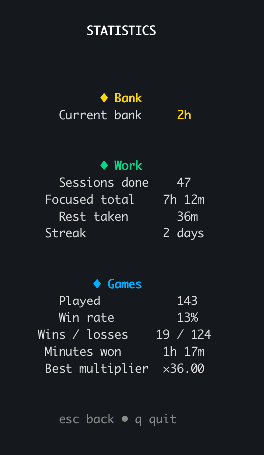
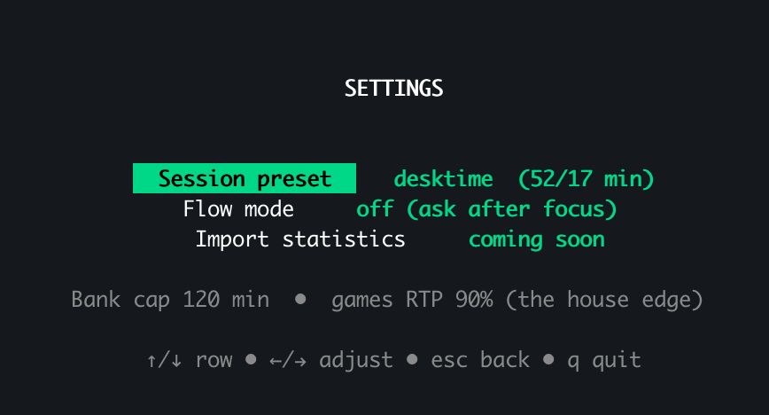

<div align="center">

# 🎰 focusbet

### Focus to earn your break — then bank it, rest it, or bet it.

**A terminal pomodoro timer with a rest-currency mini-casino.**
Every focused minute earns real break time. Stash it, spend it, or gamble it on
slots, roulette, and mines. The house always wins (RTP < 1.0), so the bank
trends down — and that's the point: it keeps pulling you back to work.

[](https://github.com/Ippolid/focusbet/actions/workflows/ci.yml)
[](https://github.com/Ippolid/focusbet/releases)
[](https://go.dev/dl/)

[Install](#install) • [How it works](#how-it-works) • [Features](#features) • [Settings](#settings)

<!-- HERO SCREENSHOT — replace docs/hero.png with a wide shot of the dashboard or focus timer -->


</div>

---

## Install

### Option 1 — `go install` (recommended)

Requires [Go 1.25+](https://go.dev/dl/). One command:

```sh
go install github.com/Ippolid/focusbet@latest
focusbet
```

> Make sure `$(go env GOPATH)/bin` is on your `PATH` so the `focusbet` command is found.

### Option 2 — download a prebuilt binary

Grab the binary for your OS from the [**Releases**](https://github.com/Ippolid/focusbet/releases) page — no Go required:

```sh
# macOS / Linux: unpack, make it executable, run
chmod +x focusbet
./focusbet
```

### Option 3 — run from source

```sh
git clone https://github.com/Ippolid/focusbet
cd focusbet
go run .
```

> focusbet needs a real terminal (it uses an alt-screen TUI). Quit anytime with `q` or `Ctrl+C`.
> Your state and config persist under your user config dir (e.g. `~/Library/Application Support/focusbet` on macOS, `~/.config/focusbet` on Linux).

---

## The idea

Most pomodoro apps just count down. focusbet turns your break into a **currency
you have to earn and decide what to do with** — a tiny loop of risk and reward
that makes focusing feel like it pays off, without becoming a time sink.

- **Earn** — finish a focus session and bank the break you worked for.
- **Choose** — keep it safe, rest now, or take it to the tables.
- **The pull back to work** — games pay out below 1.0 RTP, so over time the
  house wins and your bank shrinks. The only way to refill it is to focus again.

---

## How it works

| Step | What happens |
| --- | --- |
| **Focus** | A completed session earns rest minutes — the break you just worked for, scaled by how much of the planned focus you actually did. Finish a full cycle and you earn (and get) the longer break. |
| **Spend** | **Bank** the minutes for later, take a longer **rest** now, or **play** a game to try to grow them. |
| **Risk** | There's no protected floor — a losing round spends the minutes you wagered, by design. |

**Games**

- 🎰 **Slots** — 3-reel, weighted symbols.
- 🔴 **Roulette** — European wheel (red/black, even/odd, straight number).
- 💣 **Mines** — 5×5 board; reveal gems, cash out before you hit a mine.

Each runs at a sub-1.0 RTP (default 90%), so the bank trends down and nudges you
back to focusing.

---

## Features

- **Pomodoro engine** with presets and full custom timings
- **Rest-currency economy** — earn, bank, spend, gamble
- **Three provably-fair games** (HMAC-SHA256 RNG)
- **Flow mode** — focus → break → focus, hands-free
- **Polished TUI** — smooth progress bars, win confetti, animated screens
- **Multi-channel alerts** — desktop notification + sound + visual on phase end
- **Lifetime stats** — focused hours, streak, win rate, best multiplier
- **Local-only persistence** — plain JSON under your config dir, no account

---

## Screenshots

<!-- Replace these placeholders with real captures. Suggested: 1280px wide, dark terminal. -->

| Focus timer | Result fork |
| --- | --- |
|  |  |

| Slots | Mines | Roulette |
| --- | --- | --- |
|  |  |  |

| Stats | Settings |
| --- | --- |
|  |  |

---

## Settings

- **Session preset** — `classic` (25/5), `deep` (50/10), `desktime` (52/17),
  `short` (15/3), or `custom`. Custom exposes editable focus length, break
  length, sessions-to-long-break, and long-break length.
- **Flow mode** — on chains focus → rest → focus automatically; off shows a fork
  after each focus session.
- **Stakes** — set in fractional minutes (15-second steps), shown as `MM:SS`.

---

<div align="center">

Built with [Bubble Tea](https://github.com/charmbracelet/bubbletea)

**Focus more. Bet responsibly.**

</div>
